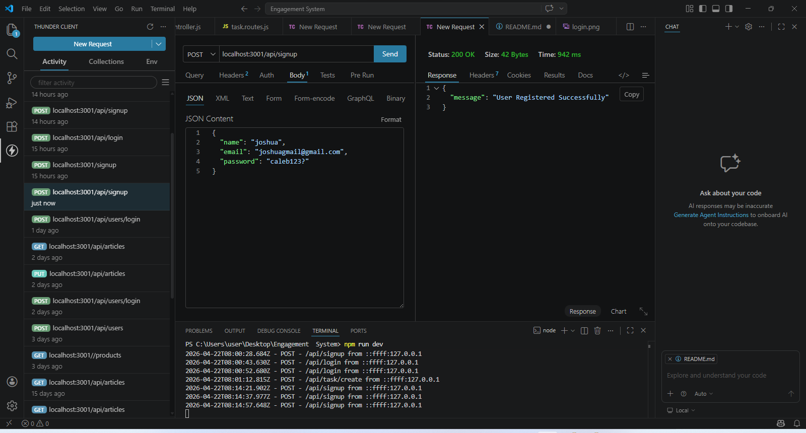
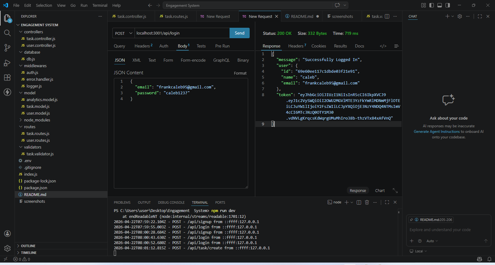
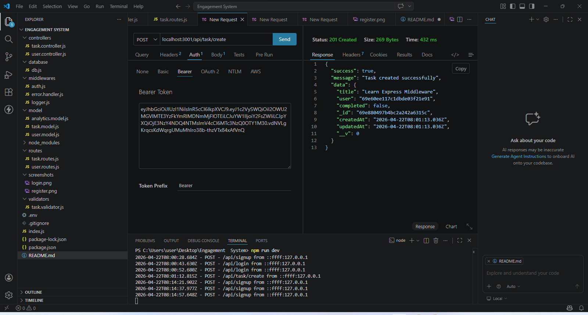

# 🚀 Task Progress & Analytics API

A production-ready backend API for managing tasks, tracking user progress, and generating analytics insights.

---

## 📌 Overview

This API allows users to:

* Register and authenticate
* View assigned tasks
* Mark tasks as completed
* Track progress over time
* Access analytics data for dashboards

Built with scalability and frontend integration in mind.

---

## 🧱 Tech Stack

* Node.js
* Express.js
* MongoDB (Mongoose)
* JWT Authentication
* Joi Validation

---

## 📁 Project Structure

```
project-root/
│
├── src/
│   ├── controllers/
│   ├── models/
│   ├── routes/
│   ├── middlewares/
    |--- validators/
│   
│
├── docs/
│   └── screenshots/
│
├── .env.example
├── package.json
└── README.md
```

---

## ⚙️ Environment Variables

Create a `.env` file in the root directory and add:

```
PORT=10000
MONGO_URI=your_mongodb_connection_string
JWT_SECRET=your_super_secret_key
```

---

## 🚀 Getting Started

### 1. Clone the repository

```
git clone <your-repo-url>
cd <your-project-folder>
```

### 2. Install dependencies

```
npm install
```

### 3. Run the server

```
npm run dev
```

Server will start on:

```
http://localhost:001
```

---

## 🔐 Authentication

All protected routes require a JWT token.

Add this header:

```
Authorization: Bearer <your_token>
```

---

## 📡 API Endpoints

### 🧑‍💻 Auth

#### Register User

```
POST /api/auth/register
```

#### Login User

```
POST /api/auth/login
```

---

### 📋 Tasks

#### Get All Tasks

```
GET /api/tasks
```

#### Complete Task

```
POST /api/task/complete
```

**Body:**

```
{
  "task_id": "task_id_here"
}
```

---

### 📊 Analytics

#### Get User Progress

```
GET /api/user/progress
```

**Response Example:**

```
{
  "total_tasks": 10,
  "completed_tasks": 6,
  "progress_percent": 60,
  "last_active": "2026-04-21T10:00:00Z" || null
}
```

---

## 🧪 Testing

Used Postman and Thunder Client to test endpoints.

### Recommended Flow:

1. Register a user
2. Login to get JWT token
3. Use token to access protected routes
4. Fetch tasks
5. Complete a task
6. Check progress endpoint

---

## 🖼️ API Testing Screenshots

### Register User



### Login (JWT Token)



### Get Tasks


### Create Task



### User Progress


### Analytics Dashboard


---

## 🧠 Design Decisions

* Separation of concerns (MVC pattern)
* Input validation using Joi
* Secure authentication with JWT
* Scalable structure for analytics expansion

---

## ⚠️ Error Handling

Standard error response:

```
{
  "status": "error",
  "message": "Description of error"
}
```

---

## 📌 Notes for Frontend Engineers

* Base URL: `http://localhost:001/api`
* All protected routes require JWT
* Ensure correct headers are set
* Responses are JSON formatted

---

## 📦 Deployment

Render.

---

## 🤝 Contributing

Pull requests are welcome. For major changes, open an issue first.

---

## 📄 License

This project is licensed under the MIT License.

---

## 👨‍💻 Author

Built by Caleb Emerelauwaonu and 
Chukwuma Ejike
